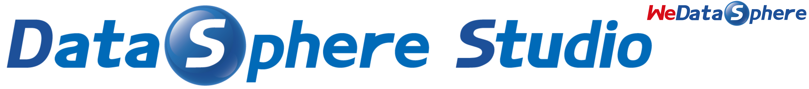
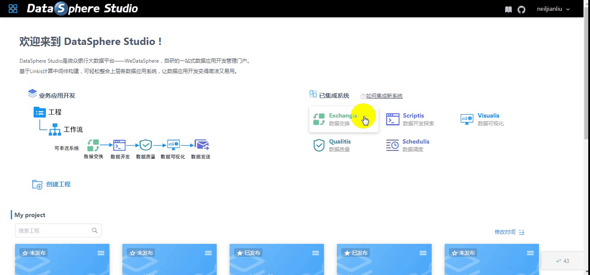
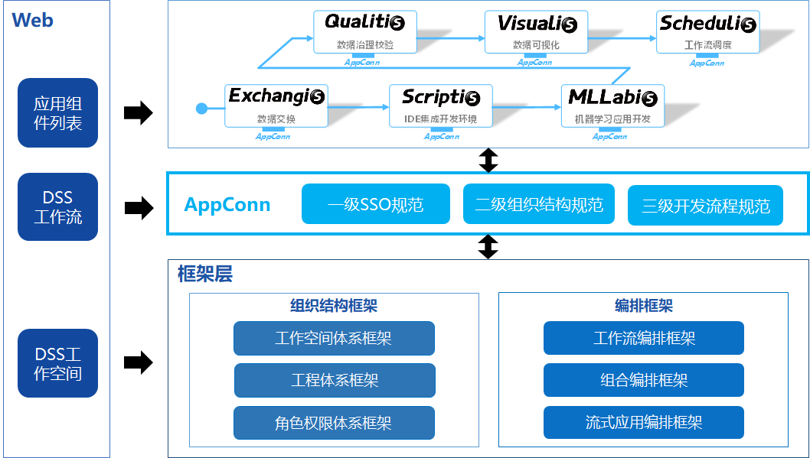

====

[English](README.md) | 中文

## 引言

 &nbsp; &nbsp; &nbsp; &nbsp;DataSphere Studio（简称 DSS）是微众银行自研的数据应用开发管理集成框架。

 &nbsp; &nbsp; &nbsp; &nbsp;基于插拔式的集成框架设计，及计算中间件 [**Linkis**](https://github.com/WeBankFinTech/Linkis) ，可轻松接入上层各种数据应用系统，让数据开发变得简洁又易用。

 &nbsp; &nbsp; &nbsp; &nbsp;在统一的 UI 下，DataSphere Studio 以工作流式的图形化拖拽开发体验，将满足从数据交换、脱敏清洗、分析挖掘、质量检测、可视化展现、定时调度到数据输出应用等，数据应用开发全流程场景需求。

 &nbsp; &nbsp; &nbsp; &nbsp;**DSS 通过插拔式的集成框架设计，让用户可以根据需要，简单快速替换 DSS 已集成的各种功能组件，或新增功能组件。**

 &nbsp; &nbsp; &nbsp; &nbsp;借助于 [**Linkis**](https://github.com/WeBankFinTech/Linkis) 计算中间件的连接、复用与简化能力，DSS 天生便具备了金融级高并发、高可用、多租户隔离和资源管控等执行与调度能力。

## 界面预览

 &nbsp; &nbsp; &nbsp; &nbsp;请您耐心等待，加载 gif 需要一些时间。

## 核心特点

 &nbsp; &nbsp; &nbsp; &nbsp;DSS 主要特点：

### 一、一站式、全流程的应用开发管理界面

 &nbsp; &nbsp; &nbsp; &nbsp;DSS 集成度极高，目前已集成的系统有（**DSS 对以上组件的版本兼容性，请访问：[已集成组件的兼容性列表](README-ZH.md#四已集成的数据应用组件)**）：
 
 &nbsp; &nbsp; &nbsp; &nbsp;1、数据开发IDE工具——[Scriptis](https://github.com/WeBankFinTech/Scriptis)
 
 &nbsp; &nbsp; &nbsp; &nbsp;2、数据可视化工具——[Visualis](https://github.com/WeBankFinTech/Visualis)（基于宜信 [Davinci](https://github.com/edp963/davinci) 二次开发）
 
 &nbsp; &nbsp; &nbsp; &nbsp;3、数据质量管理工具——[Qualitis](https://github.com/WeBankFinTech/Qualitis)
 
 &nbsp; &nbsp; &nbsp; &nbsp;4、工作流调度工具——[Schedulis](https://github.com/WeBankFinTech/Schedulis)
 
 &nbsp; &nbsp; &nbsp; &nbsp;5、数据交换工具——[Exchangis](https://github.com/WeBankFinTech/Exchangis)

 &nbsp; &nbsp; &nbsp; &nbsp;6、数据Api服务——[DataApiService](https://github.com/WeBankFinTech/DataSphereStudio-Doc/blob/main/zh_CN/%E4%BD%BF%E7%94%A8%E6%96%87%E6%A1%A3/DataApiService%E4%BD%BF%E7%94%A8%E6%96%87%E6%A1%A3.md)
 
 &nbsp; &nbsp; &nbsp; &nbsp;7、流式应用开发管理工具——[Streamis](https://github.com/WeBankFinTech/Streamis)
 
 &nbsp; &nbsp; &nbsp; &nbsp;8、一站式机器学习平台——[Prophecis](https://github.com/WeBankFinTech/Prophecis)
 
 &nbsp; &nbsp; &nbsp; &nbsp;9、工作流任务调度平台——[DolphinScheduler](https://github.com/apache/dolphinscheduler)
 
 &nbsp; &nbsp; &nbsp; &nbsp;10、数据模型中心——**DataModelCenter**(**社区联合共建中**)
 
 &nbsp; &nbsp; &nbsp; &nbsp;**DSS 对以上组件的版本兼容性，请访问：[已集成组件的兼容性列表](README-ZH.md#四已集成的数据应用组件)**。
 
 &nbsp; &nbsp; &nbsp; &nbsp;DSS 插拔式的框架设计模式，允许用户快速替换DSS已集成的各个 Web 系统。如：将 Scriptis 替换成 Zeppelin，将 Schedulis 替换成 DolphinScheduler。
 
 

### 二、基于Linkis计算中间件，打造独有的AppConn设计理念

 &nbsp; &nbsp; &nbsp; &nbsp;AppConn，是 DSS 可以简单快速集成各种上层 Web 系统的核心概念。

 &nbsp; &nbsp; &nbsp; &nbsp;AppConn ——应用连接器，定义了一套统一的前后台接入协议，总共分为三级规范，可让外部数据应用系统快速简单地接入，成为 DSS 数据应用开发中的一环。
 
 &nbsp; &nbsp; &nbsp; &nbsp;AppConn 的三级规范即：一级 SSO 规范，二级组织结构规范，三级开发流程规范；

 &nbsp; &nbsp; &nbsp; &nbsp;DSS 通过串联多个 AppConn，编排成一条支持实时执行和定时调度的工作流，用户只需简单拖拽即可完成数据应用的全流程开发。

 &nbsp; &nbsp; &nbsp; &nbsp;由于 AppConn 对接了 Linkis，外部数据应用系统因此具备了资源管控、并发限流、用户资源管理等能力，且允许上下文信息跨系统级共享，彻底告别应用孤岛。

### 三、Workspace级管理单元

 &nbsp; &nbsp; &nbsp; &nbsp;以 Workspace 为管理单元，组织和管理各数据应用系统的业务应用，定义了一套跨数据应用系统的工作空间协同开发通用标准，并提供了用户角色管理能力。

### 四、已集成的数据应用组件

 &nbsp; &nbsp; &nbsp; &nbsp;DSS 通过实现多个 AppConn，已集成了丰富多样的各种上层数据应用系统，基本可满足用户的数据开发需求。

 &nbsp; &nbsp; &nbsp; &nbsp;**如果有需要，也可以轻松集成新的数据应用系统，以替换或丰富 DSS 的数据应用开发流程。** [点我了解如何快速集成新的应用系统](https://github.com/WeBankFinTech/DataSphereStudio-Doc/blob/main/zh_CN/%E5%BC%80%E5%8F%91%E6%96%87%E6%A1%A3/%E7%AC%AC%E4%B8%89%E6%96%B9%E7%B3%BB%E7%BB%9F%E6%8E%A5%E5%85%A5DSS%E5%BC%80%E5%8F%91%E6%8C%87%E5%8D%97.md)

| 应用工具     | 描述                                                          | DSS0.X 兼容版本(推荐 DSS0.9.1)   | DSS1.0 兼容版本(推荐 DSS1.1.0)    |
| --------------- | -------------------------------------------------------------------- | --------- | ---------- |
| [**Linkis**](https://github.com/apache/incubator-linkis) | 计算中间件 Apache Linkis，通过提供 REST/WebSocket/JDBC/SDK 等标准接口，上层应用可以方便地连接访问 MySQL/Spark/Hive/Presto/Flink 等底层引擎. | 推荐 Linkis0.11.0（**已发布**） | >= Linkis1.1.1（**已发布**） |
| [**DataApiService**](https://github.com/WeBankFinTech/DataSphereStudio-Doc/blob/main/zh_CN/%E4%BD%BF%E7%94%A8%E6%96%87%E6%A1%A3/DataApiService%E4%BD%BF%E7%94%A8%E6%96%87%E6%A1%A3.md)  | （DSS已内置的第三方应用工具）数据API服务。可快速将SQL脚本发布为一个 Restful 接口，对外提供 Rest 访问能力。    | 不支持 | 推荐 DSS1.1.0（**已发布**）|
| [**Scriptis**](https://github.com/WeBankFinTech/DataSphereStudio)   | （DSS 已内置的第三方应用工具）支持在线写 SQL、Pyspark、HiveQL 等脚本，提交给 [Linkis](https://github.com/WeBankFinTech/Linkis) 执行的数据分析 Web 工具。 | 推荐 DSS0.9.1（**已发布**） | 推荐 DSS1.1.0（**已发布**） |
| [**Schedulis**](https://github.com/WeBankFinTech/Schedulis) | 基于 Azkaban 二次开发的工作流任务调度系统,具备高性能，高可用和多租户资源隔离等金融级特性。 | 推荐 Schedulis0.6.1（**已发布**） | >= Schedulis0.7.0（**已发布**） |
| **EventCheck**  | （DSS 已内置的第三方应用工具）提供跨业务、跨工程和跨工作流的信号通信能力。 | 推荐 DSS0.9.1（**已发布**） | 推荐 DSS1.1.0（**已发布**） |
| **SendEmail**   | （DSS 已内置的第三方应用工具）提供数据发送能力，所有其他工作流节点的结果集，都可以通过邮件进行发送 | 推荐 DSS0.9.1（**已发布**） | 推荐 DSS1.1.0（**已发布**） |
| [**Qualitis**](https://github.com/WeBankFinTech/Qualitis)   | 数据质量校验工具，提供数据完整性、正确性等数据校验能力 | 推荐 Qualitis0.8.0（**已发布**） | >= Qualitis0.9.2（**已发布**） |
| [**Streamis**](https://github.com/WeBankFinTech/Streamis)  | 流式应用开发管理工具。支持发布 Flink Jar 和 Flink SQL ，提供流式应用的开发调试和生产管理能力，如：启停、状态监控、checkpoint 等。 | 不支持 | >= Streamis0.2.0（**已发布**） |
| [**Prophecis**](https://github.com/WeBankFinTech/Prophecis)     | 一站式机器学习平台，集成多种开源机器学习框架。Prophecis 的 MLFlow 通过 AppConn 可以接入到 DSS 工作流中。      | 不支持 | >= Prophecis 0.3.2（**已发布**） |
| [**Exchangis**](https://github.com/WeBankFinTech/Exchangis) | 支持对结构化及无结构化的异构数据源之间的数据传输的数据交换平台，即将发布的 Exchangis1.0，将与 DSS 工作流打通 | 不支持 | = Exchangis1.0.0（**已发布**） |
| [**Visualis**](https://github.com/WeBankFinTech/Visualis)   | 基于宜信开源项目 Davinci 二次开发的数据可视化 BI 工具，为用户在数据安全方面提供金融级数据可视化能力。 | 推荐 Visualis0.5.0 | = Visualis1.0.0（**已发布**） |
| [**DolphinScheduler**](https://github.com/apache/dolphinscheduler) | Apache DolphinScheduler，分布式易扩展的可视化工作流任务调度平台，支持一键将DSS工作流发布到 DolphinScheduler。    | 不支持 | DolphinScheduler1.3.X（**已发布**） |
| **UserGuide**     | （DSS 将内置的第三方应用工具）包含帮助文档、新手指引、Dark模式换肤等。      | 不支持 | >= DSS1.1.0（**已发布**） |
| **DataModelCenter**     | （DSS 将内置的第三方应用工具）主要提供数仓规划、数据模型开发和数据资产管理的能力。数仓规划包含主题域、数仓分层、修饰词等；数据模型开发包含指标、维度、度量、向导式建表等；数据资产打通 **Apache Atlas**，提供**数据血缘**能力。      | 不支持 | 规划在 DSS1.2.0（**开发中**） |
| **UserManager** | （DSS 已内置的第三方应用工具）自动初始化一个 DSS 新用户所必须的所有用户环境，包含：创建 Linux 用户、各种用户路径、目录授权等。                 |  推荐 DSS0.9.1（**已发布**） | 规划中 |
| [**Airflow**](https://github.com/apache/airflow)     | 支持将 DSS 工作流发布到 Apache Airflow 进行定时调度。      | PR 尚未合并 | 不支持 |

## Demo试用环境

 &nbsp; &nbsp; &nbsp; &nbsp;由于 DataSphereStudio 支持执行脚本风险较高，WeDataSphere Demo 环境的隔离没有做完，考虑到大家都在咨询 Demo 环境，决定向社区先定向发放邀请码，接受企业和组织的试用申请。

 &nbsp; &nbsp; &nbsp; &nbsp;如果您想试用 Demo 环境，请加入DataSphere Studio社区用户群（**加群方式请翻到本文档末尾处**），联系 **WeDataSphere 入群机器人** 获取邀请码。

 &nbsp; &nbsp; &nbsp; &nbsp;DataSphereStudio Demo 环境用户注册页面：[点我进入](https://dss-open.wedatasphere.com/#/register)

 &nbsp; &nbsp; &nbsp; &nbsp;DataSphereStudio Demo 环境登录页面：[点我进入](https://dss-open.wedatasphere.com/#/login)

## 下载

 &nbsp; &nbsp; &nbsp; &nbsp;请前往 [DSS releases](https://github.com/WeBankFinTech/DataSphereStudio/releases) 页面下载 DSS 的已编译版本或源码包。

## 编译和安装部署

 &nbsp; &nbsp; &nbsp; &nbsp;请参照 [编译指引](https://github.com/WeBankFinTech/DataSphereStudio-Doc/blob/main/zh_CN/%E5%BC%80%E5%8F%91%E6%96%87%E6%A1%A3/DSS%E7%BC%96%E8%AF%91%E6%96%87%E6%A1%A3.md) 来编译 DSS 源码。

 &nbsp; &nbsp; &nbsp; &nbsp;请参考 [安装部署文档](https://github.com/WeBankFinTech/DataSphereStudio-Doc/blob/main/zh_CN/%E5%AE%89%E8%A3%85%E9%83%A8%E7%BD%B2/DSS%26Linkis%E4%B8%80%E9%94%AE%E9%83%A8%E7%BD%B2%E6%96%87%E6%A1%A3%E5%8D%95%E6%9C%BA%E7%89%88.md) 来部署 DSS。

## 示例和使用指引

 &nbsp; &nbsp; &nbsp; &nbsp;请到 [用户使用文档](https://github.com/WeBankFinTech/DataSphereStudio-Doc/blob/main/zh_CN/%E4%BD%BF%E7%94%A8%E6%96%87%E6%A1%A3/DSS%E7%94%A8%E6%88%B7%E6%89%8B%E5%86%8C.md) ，了解如何快速使用DSS。

## 文档

 &nbsp; &nbsp; &nbsp; &nbsp;DSS1.0 的完整文档列表，请参见 [DSS-Doc](https://github.com/WeBankFinTech/DataSphereStudio-Doc/tree/main/zh_CN)

 &nbsp; &nbsp; &nbsp; &nbsp;以下为 DSS 相关 AppConn 插件的安装指南：

- [DSS 的 Visualis AppConn 插件安装指南](https://github.com/WeBankFinTech/Visualis/blob/master/visualis_docs/zh_CN/Visualis_appconn_install_cn.md)

- [DSS 的 Schedulis AppConn 插件安装指南](https://github.com/WeBankFinTech/DataSphereStudio-Doc/blob/main/zh_CN/%E5%AE%89%E8%A3%85%E9%83%A8%E7%BD%B2/SchedulisAppConn%E6%8F%92%E4%BB%B6%E5%AE%89%E8%A3%85%E6%96%87%E6%A1%A3.md)

- [DSS 的 Qualitis AppConn 插件安装指南](https://github.com/WeBankFinTech/Qualitis/blob/master/docs/zh_CN/ch1/%E6%8E%A5%E5%85%A5%E5%B7%A5%E4%BD%9C%E6%B5%81%E6%8C%87%E5%8D%97.md)

- [DSS 的 Exchangis AppConn 插件安装指南](https://github.com/WeDataSphere/Exchangis/blob/master/docs/zh_CN/ch1/exchangis_appconn_deploy_cn.md)

- [DSS 的 Streamis AppConn 插件安装指南](https://github.com/WeBankFinTech/Streamis/blob/main/docs/zh_CN/%E5%AE%89%E8%A3%85%E6%96%87%E6%A1%A3/AppConn%E7%9A%84%E4%BD%BF%E7%94%A8.md)

- [DSS 的 Prophecis AppConn 插件安装指南](https://github.com/WeBankFinTech/Prophecis/blob/master/docs/zh_CN/Deployment_Documents/Prophecis%20Appconn%E5%AE%89%E8%A3%85%E6%96%87%E6%A1%A3.md)

- [DSS 的 Dolphinscheduler AppConn 插件安装指南](https://github.com/WeBankFinTech/DataSphereStudio-Doc/blob/main/zh_CN/%E5%AE%89%E8%A3%85%E9%83%A8%E7%BD%B2/DolphinScheduler%E6%8F%92%E4%BB%B6%E5%AE%89%E8%A3%85%E6%96%87%E6%A1%A3.md)

## 架构

## 使用场景

 &nbsp; &nbsp; &nbsp; &nbsp;DataSphere Studio 适用于以下场景：

 &nbsp; &nbsp; &nbsp; &nbsp;1. 正在筹建或初步具备大数据平台能力，但无任何数据应用工具的场景。

 &nbsp; &nbsp; &nbsp; &nbsp;2. 已具备大数据基础平台能力，且仅有少数数据应用工具的场景。

 &nbsp; &nbsp; &nbsp; &nbsp;3. 已具备大数据基础平台能力，且拥有全部数据应用工具，但工具间尚未打通，用户使用隔离感强、学习成本高的场景。

 &nbsp; &nbsp; &nbsp; &nbsp;4. 已具备大数据基础平台能力，且拥有全部数据应用工具，部分工具已实现对接，但尚未定义统一规范的场景。

## 贡献

 &nbsp; &nbsp; &nbsp; &nbsp;我们非常欢迎和期待更多的贡献者参与共建 DSS, 不论是代码、文档，或是其他能够帮助到社区的贡献形式。

## 联系我们

 &nbsp; &nbsp; &nbsp; &nbsp;对 DSS 的任何问题和建议，敬请提交 issue，以便跟踪处理和经验沉淀共享。

 &nbsp; &nbsp; &nbsp; &nbsp;您也可以扫描下面的二维码，加入我们的 微信/QQ群，以获得更快速的响应。

## 谁在使用 DSS

 &nbsp; &nbsp; &nbsp; &nbsp;我们创建了 [Who is using DSS](https://github.com/WeBankFinTech/DataSphereStudio/issues/1) issue 以便用户反馈和记录谁在使用 DSS，欢迎您注册登记.

 &nbsp; &nbsp; &nbsp; &nbsp;DSS 自2019年开源发布以来，累计已有700多家试验企业和1000+沙盒试验用户，涉及金融、电信、制造、互联网等多个行业。

## License

 &nbsp; &nbsp; &nbsp; &nbsp;DSS is under the Apache 2.0 license. See the [License](https://github.com/WeBankFinTech/DataSphereStudio/blob/master/LICENSE) file for details.
