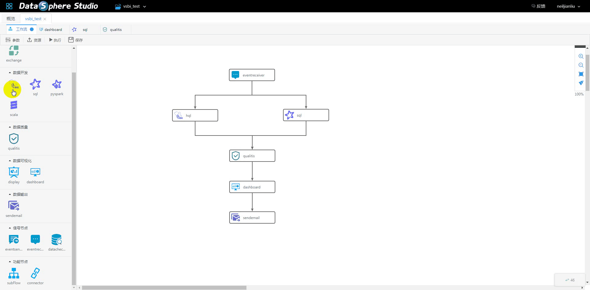
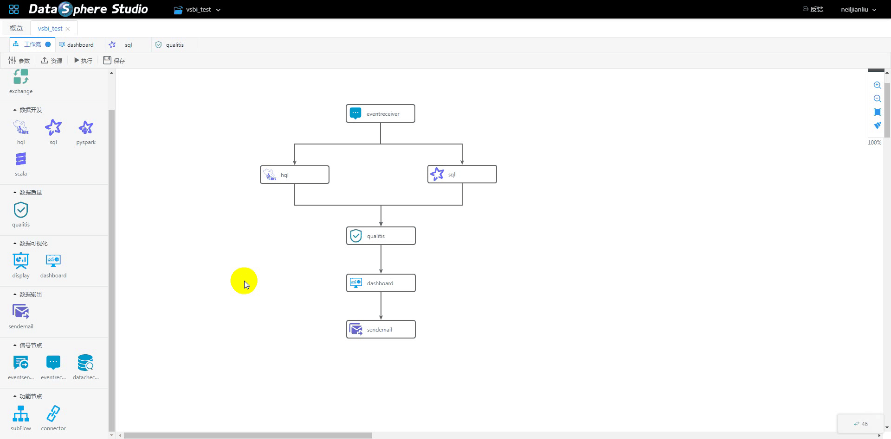
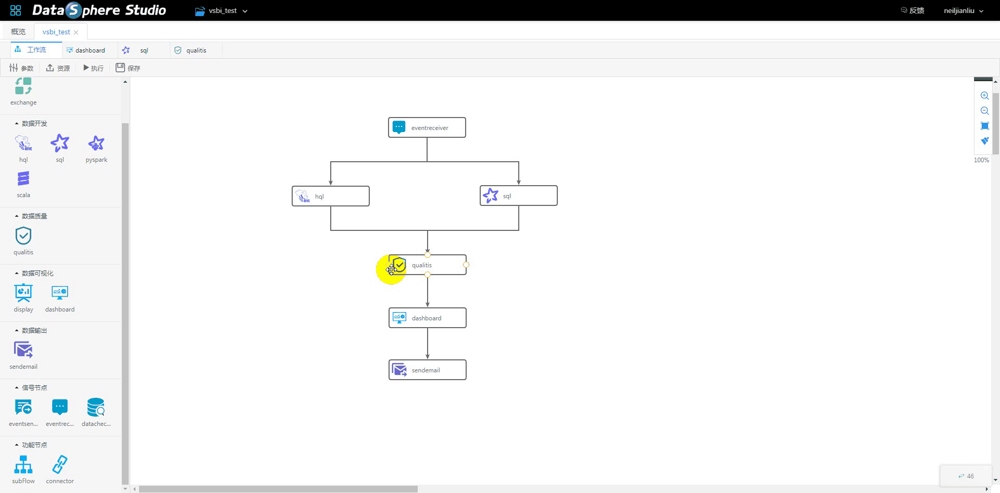

====

[English](README.md) | 中文

## 引言

DataSphere Studio（简称DSS）是微众银行大数据平台——WeDataSphere，自研的一站式数据应用开发管理门户。

基于 [**Linkis**](https://github.com/WeBankFinTech/Linkis) 计算中间件构建，可轻松整合上层各数据应用系统，让数据应用开发变得简洁又易用。

DataSphere Studio定位为数据应用开发门户，闭环涵盖数据应用开发全流程。在统一的UI下，以工作流式的图形化拖拽开发体验，满足从数据导入、脱敏清洗、分析挖掘、质量检测、可视化展现、定时调度到数据输出应用等，数据应用开发全流程场景需求。

借助于Linkis计算中间件的连接、复用与简化能力，DSS天生便具备了金融级高并发、高可用、多租户隔离和资源管控等执行与调度能力。

## 界面预览

请您耐心等待，加载gif需要一些时间。

## 核心特点

DSS主要特点：

### 一、一站式、全流程的应用开发管理界面

&nbsp; &nbsp; &nbsp; &nbsp;DSS集成度极高，目前已集成的系统有：
 
 &nbsp; &nbsp; &nbsp; &nbsp;1、数据开发IDE工具——[Scriptis](https://github.com/WeBankFinTech/Scriptis)
 
 &nbsp; &nbsp; &nbsp; &nbsp;2、数据可视化工具——[Visualis](https://github.com/WeBankFinTech/Visualis)（基于宜信[Davinci](https://github.com/edp963/davinci)二次开发）
 
 &nbsp; &nbsp; &nbsp; &nbsp;3、数据质量管理工具——[Qualitis](https://github.com/WeBankFinTech/Qualitis)
 
 &nbsp; &nbsp; &nbsp; &nbsp;4、工作流调度工具——[Azkaban](https://azkaban.github.io/)
 
 

### 二、基于Linkis计算中间件，打造独有的AppJoint设计理念

 &nbsp; &nbsp; &nbsp; &nbsp;AppJoint——应用关节，定义了一套统一的前后台接入规范，可让外部数据应用系统快速简单地接入，成为DSS数据应用开发中的一环。

 &nbsp; &nbsp; &nbsp; &nbsp;DSS通过串联多个AppJoint，编排成一条支持实时执行和定时调度的工作流，用户只需简单拖拽即可完成数据应用的全流程开发。

 &nbsp; &nbsp; &nbsp; &nbsp;由于AppJoint对接了Linkis，外部数据应用系统因此具备了资源管控、并发限流、用户资源管理等能力，且允许上下文信息跨系统级共享，彻底告别应用孤岛。

### 三、Project级管理单元

 &nbsp; &nbsp; &nbsp; &nbsp;以Project为管理单元，组织和管理各数据应用系统的业务应用，定义了一套跨数据应用系统的项目协同开发通用标准。

### 四、已集成的数据应用组件

 &nbsp; &nbsp; &nbsp; &nbsp;1、DSS的调度能力——Azkaban AppJoint

&nbsp; &nbsp; &nbsp; &nbsp; &nbsp; &nbsp;用户的很多数据应用，通常希望具备周期性的调度能力。
                                                 
&nbsp; &nbsp; &nbsp; &nbsp; &nbsp; &nbsp;目前市面上已有的开源调度系统，与上层的其他数据应用系统整合度低，且难以融通。
                                                 
&nbsp; &nbsp; &nbsp; &nbsp; &nbsp; &nbsp;DSS通过实现Azkaban AppJoint，允许用户将一个编排好的工作流，一键发布到Azkaban中进行定时调度。
                                                 
&nbsp; &nbsp; &nbsp; &nbsp; &nbsp; &nbsp;DSS还为调度系统定义了一套标准且通用的DSS工作流解析发布规范，让其他调度系统可以轻松与DSS实现低成本对接。
                                                 

 &nbsp; &nbsp; &nbsp; &nbsp;2、数据开发——Scriptis AppJoint

&nbsp; &nbsp; &nbsp; &nbsp; &nbsp; &nbsp;什么是[Scriptis](https://github.com/WeBankFinTech/Scriptis)?
                                                 
&nbsp; &nbsp; &nbsp; &nbsp; &nbsp; &nbsp;Scriptis是一款支持在线写SQL、Pyspark、HiveQL等脚本，提交给[Linkis](https://github.com/WeBankFinTech/Linkis)执行的数据分析Web工具，且支持UDF、函数、资源管控和智能诊断等企业级特性。
                                                
&nbsp; &nbsp; &nbsp; &nbsp; &nbsp; &nbsp;Scriptis AppJoint为DSS集成了Scriptis的数据开发能力，并允许Scriptis的各种脚本类型，作为DSS工作流的节点，参与到应用开发的流程中。
                                                
&nbsp; &nbsp; &nbsp; &nbsp; &nbsp; &nbsp;目前已支持HiveSQL、SparkSQL、Pyspark、Scala等脚本节点类型。
                                                

 &nbsp; &nbsp; &nbsp; &nbsp;3、数据可视化——Visualis AppJoint

&nbsp; &nbsp; &nbsp; &nbsp; &nbsp; &nbsp;什么是Visualis?
                                                 
&nbsp; &nbsp; &nbsp; &nbsp; &nbsp; &nbsp;Visualis是一个基于宜信开源项目Davinci二次开发的数据可视化BI工具，为用户在数据安全和权限方面，提供金融级数据可视化能力。
                                                
&nbsp; &nbsp; &nbsp; &nbsp; &nbsp; &nbsp;Visualis AppJoint为DSS集成了Visualis的数据可视化能力，并允许数据大屏和仪表盘，作为DSS工作流的节点，与上游的数据集市关联起来。
                                                

 &nbsp; &nbsp; &nbsp; &nbsp;4、数据质量——Qualitis AppJoint

&nbsp; &nbsp; &nbsp; &nbsp; &nbsp; &nbsp;Qualitis AppJoint 为DSS集成数据质量校验能力，将数据质量系统集成到DSS工作流开发中，对数据完整性、正确性等进行校验。
                                                

 &nbsp; &nbsp; &nbsp; &nbsp;5、数据发送——Sender AppJoint

&nbsp; &nbsp; &nbsp; &nbsp; &nbsp; &nbsp;Sender AppJoint为DSS集成数据发送能力，目前支持SendEmail节点类型，所有其他节点的结果集，都可以通过邮件发送。
                                                 
&nbsp; &nbsp; &nbsp; &nbsp; &nbsp; &nbsp;例如：SendEmail节点可直接将Display数据大屏作为邮件发送出来。
  
 &nbsp; &nbsp; &nbsp; &nbsp;6、信号节点——Signal AppJoint

&nbsp; &nbsp; &nbsp; &nbsp; &nbsp; &nbsp;EventChecker AppJoint用于强化业务与流程之间的解耦和相互关联。
                                                
&nbsp; &nbsp; &nbsp; &nbsp; &nbsp; &nbsp;DataChecker节点：检查库表分区是否存在。
                                                    
&nbsp; &nbsp; &nbsp; &nbsp; &nbsp; &nbsp;EventSender: 跨工作流和工程的消息发送节点。
                                                 
&nbsp; &nbsp; &nbsp; &nbsp; &nbsp; &nbsp;EventReceiver: 跨工作流和工程的消息接收节点。
   
 &nbsp; &nbsp; &nbsp; &nbsp;7、功能节点
   
&nbsp; &nbsp; &nbsp; &nbsp; &nbsp; &nbsp;空节点、子工作流节点。

## 与类似系统对比

 &nbsp; &nbsp; &nbsp; &nbsp;DSS是一个引领数据应用开发管理方向的开源项目，开源社区目前尚没有同类产品。

## 使用场景

 &nbsp; &nbsp; &nbsp; &nbsp;DataSphere Studio适用于以下场景：

 &nbsp; &nbsp; &nbsp; &nbsp;1. 正在筹建或初步具备大数据平台能力，但无任何数据应用工具的场景。

 &nbsp; &nbsp; &nbsp; &nbsp;2. 已具备大数据基础平台能力，且仅有少数数据应用工具的场景。

 &nbsp; &nbsp; &nbsp; &nbsp;3. 已具备大数据基础平台能力，且拥有全部数据应用工具，但工具间尚未打通，用户使用隔离感强、学习成本高的场景。

 &nbsp; &nbsp; &nbsp; &nbsp;4. 已具备大数据基础平台能力，且拥有全部数据应用工具，部分工具已实现对接，但尚未定义统一规范的场景。

## 快速安装使用

点我进入[快速安装使用](docs/zh_CN/ch2/DSS快速安装使用文档.md)

## 架构

## 文档列表

[DSS编译文档](docs/zh_CN/ch1/DSS编译文档.md)

[用户手册](docs/zh_CN/ch3/DSS_User_Manual.md)

[外部系统快速接入DSS](docs/zh_CN/ch4/第三方系统接入DSS指南.md)

[如何接入调度系统Azkaban](docs/zh_CN/ch4/如何接入调度系统Azkaban.md)

更多文档，敬请期待！

## 交流贡献

## License

DSS is under the Apache 2.0 license. See the [License](LICENSE) file for details.