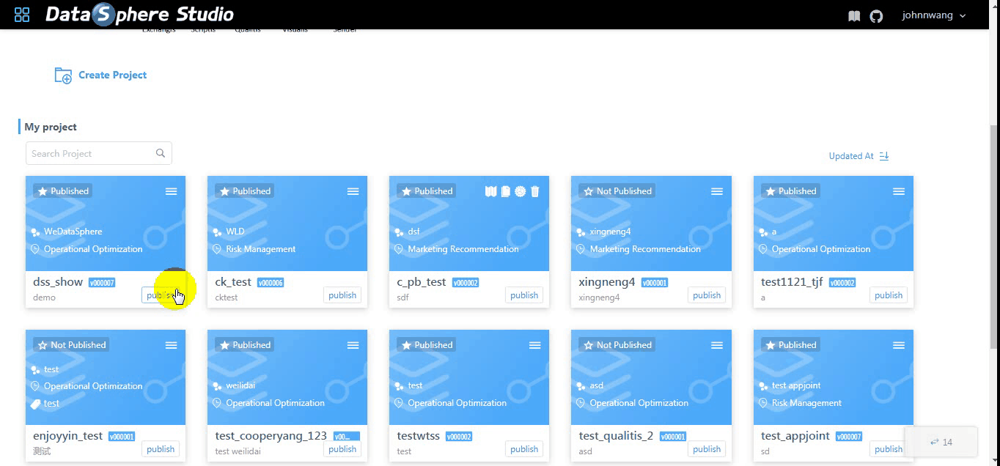
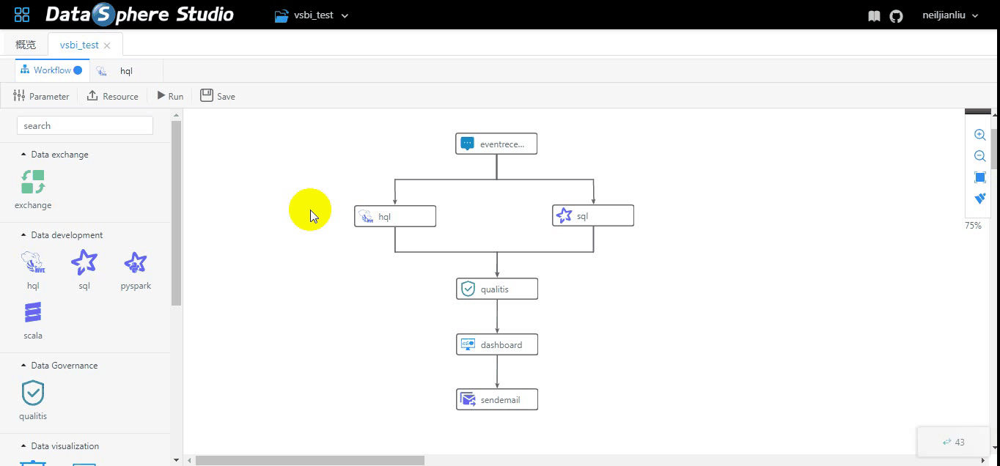
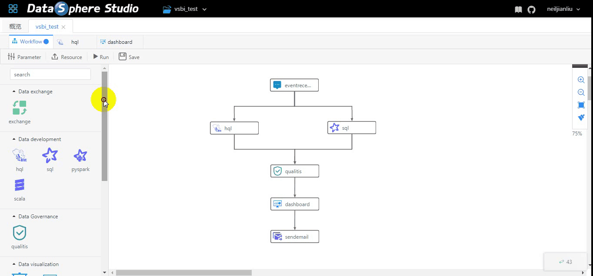
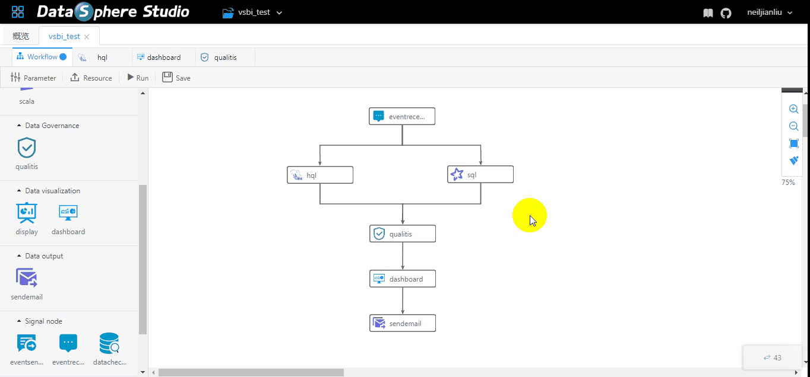
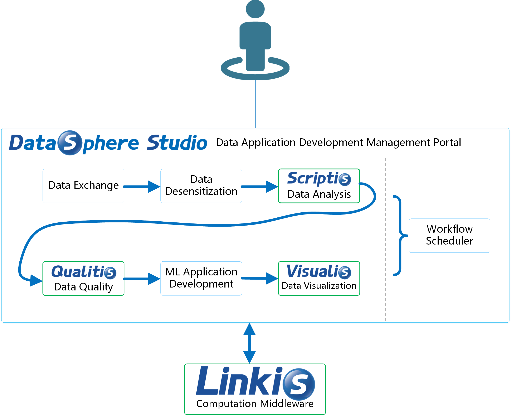
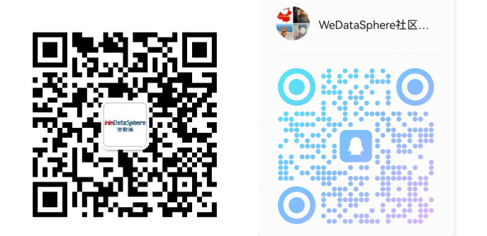

====

English | [中文](README-ZH.md)

## Introduction

DataSphere Studio (DSS for short) is WeDataSphere, a big data platform of WeBank, a self-developed one-stop data application development management portal.

Based on [Linkis](https://github.com/WeBankFinTech/Linkis) computation middleware, DSS can easily integrate upper-level data application systems, making data application development simple and easy to use.

DataSphere Studio is positioned as a data application development portal, and the closed loop covers the entire process of data application development. With a unified UI, the workflow-like graphical drag-and-drop development experience meets the entire lifecycle of data application development from data import, desensitization cleaning, data analysis, data mining, quality inspection, visualization, scheduling to data output applications, etc.

With the connection, reusability, and simplification capabilities of Linkis, DSS is born with financial-grade capabilities of high concurrency, high availability, multi-tenant isolation, and resource management.

## UI preview

Please be patient, it will take some time to load gif.

## Core features

### 1. One-stop, full-process application development management UI

&nbsp; &nbsp; &nbsp; &nbsp;DSS is highly integrated. Currently integrated systems include:
 
 &nbsp; &nbsp; &nbsp; &nbsp;a. [Scriptis](https://github.com/WeBankFinTech/Scriptis) - Data Development IDE Tool.
 
 &nbsp; &nbsp; &nbsp; &nbsp;b. [Visualis](https://github.com/WeBankFinTech/Visualis) - Data Visualization Tool(Based on the open source project [Davinci](https://github.com/edp963/davinci) contributed by CreditEase)
 
 &nbsp; &nbsp; &nbsp; &nbsp;c. [Qualitis](https://github.com/WeBankFinTech/Qualitis) - Data Quality Management Tool
 
 &nbsp; &nbsp; &nbsp; &nbsp;d. [Azkaban](https://azkaban.github.io/) - Batch workflow job scheduler
 
 

### 2. AppJoint, based on Linkis，defines a unique design concept

 &nbsp; &nbsp; &nbsp; &nbsp;AppJoint——application joint, defining unified front-end and back-end 
                            integration specifications, can quickly and easily integrate with external data application systems, 
                            making them as part of DSS data application development.

 &nbsp; &nbsp; &nbsp; &nbsp;DSS arranges multiple AppJoints in series to form a workflow that supports real-time execution and scheduled execution. Users can complete the entire process development of data applications with simple drag and drop operations.

 &nbsp; &nbsp; &nbsp; &nbsp;Since AppJoint is integrated with Linkis, the external data application system shares the capabilities of resource management, concurrent limiting, and high performance. AppJoint also allows sharable context across system level and completely gets away from application silos.

### 3. Project, as the management unit

 &nbsp; &nbsp; &nbsp; &nbsp;With Project as the management unit, DSS organizes and manages the business applications of each data application system, and defines a set of common standards for collaborative development of projects across data application systems.

### 4. Integrated data application components

 &nbsp; &nbsp;&nbsp; &nbsp;a. Azkaban AppJoint —— Batch workflow job scheduler

&nbsp; &nbsp; &nbsp; &nbsp; &nbsp;Many data applications developed by users usually require periodic scheduling capability.
                                                 
&nbsp; &nbsp; &nbsp; &nbsp; &nbsp;At present, the open source scheduling system in the community is pretty unfriendly to integrate with other data application systems.
                                                 
&nbsp; &nbsp; &nbsp; &nbsp; &nbsp;DSS implements Azkaban AppJoint, which allows users to publish DSS workflows to Azkaban for regular scheduling.
                                                 
&nbsp; &nbsp; &nbsp; &nbsp; &nbsp;DSS also defines standard and generic workflow parsing and publishing specifications for scheduling systems, allowing other scheduling systems to easily achieve low-cost integration with DSS.
                                                 

 &nbsp; &nbsp;&nbsp; &nbsp;b. Scriptis AppJoint —— Data Development IDE Tool

&nbsp; &nbsp; &nbsp; &nbsp; &nbsp;What is [Scriptis](https://github.com/WeBankFinTech/Scriptis)?
                                                 
&nbsp; &nbsp; &nbsp; &nbsp; &nbsp;Scriptis is for interactive data analysis with script development(SQL, Pyspark, HiveQL), task submission(Spark, Hive), UDF, function, resource management and intelligent diagnosis.
                                                
&nbsp; &nbsp; &nbsp; &nbsp; &nbsp;Scriptis AppJoint integrates the data development capabilities of Scriptis to DSS, and allows various script types of Scriptis to serve as nodes in the DSS workflow to participate in the application development process.
                                                
&nbsp; &nbsp; &nbsp; &nbsp; &nbsp;Currently supports HiveSQL, SparkSQL, Pyspark, Scala and other script node types.
                                                

 &nbsp; &nbsp;&nbsp; &nbsp;c. Visualis AppJoint —— Data Visualization Tool

&nbsp; &nbsp; &nbsp; &nbsp; &nbsp;What is [Visualis](https://github.com/WeBankFinTech/Visualis)?
                                                 
&nbsp; &nbsp; &nbsp; &nbsp; &nbsp;Visualis is a BI tool for data visualization. It provides financial-grade data visualization capabilities on the basis of data security and permissions, based on the open source project Davinci contributed by CreditEase.
                                                
&nbsp; &nbsp; &nbsp; &nbsp; &nbsp;Visualis AppJoint integrates data visualization capabilities to DSS, and allows displays and dashboards, as nodes of DSS workflows, to be associated with upstream data market.
                                                

 &nbsp; &nbsp;&nbsp; &nbsp;d. Qualitis AppJoint —— Data quality management Tool

&nbsp; &nbsp; &nbsp; &nbsp; &nbsp;Qualitis AppJoint integrates data quality verification capabilities for DSS, allows Qualitis as a node in DSS workflow
                                                

 &nbsp; &nbsp;&nbsp; &nbsp;e. Data Sender——Sender AppJoint

&nbsp; &nbsp; &nbsp; &nbsp; &nbsp;Sender AppJoint provides data delivery capability for DSS. Currently it supports the SendEmail node type, and the result sets of all other nodes can be sent via email.
                                                 
&nbsp; &nbsp; &nbsp; &nbsp; &nbsp;For example, the SendEmail node can directly send the screen shot of a display as an email.  

 &nbsp; &nbsp;&nbsp; &nbsp;f. Signal AppJoint —— Signal Nodes

&nbsp; &nbsp; &nbsp; &nbsp; &nbsp;Signal AppJoint is used to strengthen the correlation between business and process while keeping them decoupled.
                                                
&nbsp; &nbsp; &nbsp; &nbsp; &nbsp;DataChecker Node：Checks whether a table or partition exists.
                                                    
&nbsp; &nbsp; &nbsp; &nbsp; &nbsp;EventSender Node: Messaging nodes across workflows and projects.
                                                 
&nbsp; &nbsp; &nbsp; &nbsp; &nbsp;EventReceiver: Receive nodes for messages across workflows and projects.
   
 &nbsp; &nbsp;&nbsp; &nbsp;g. Function node
   
&nbsp; &nbsp; &nbsp; &nbsp; &nbsp;Empty nodes, sub workflow nodes.

##  Compared with similar systems

 &nbsp; &nbsp;&nbsp; &nbsp;DSS is an open source project leading the direction of data application development and management.
 The open source community currently does not have similar products.

## Usage Scenarios

 &nbsp; &nbsp;&nbsp; &nbsp;DataSphere Studio is suitable for the following scenarios:

 &nbsp; &nbsp;&nbsp; &nbsp;1. Scenarios in which big data platform capability is being prepared or initialized but no data application tools are available.

 &nbsp; &nbsp;&nbsp; &nbsp;2. Scenarios in which users already have big data foundation platform capabilities but with only a few data application tools.

 &nbsp; &nbsp;&nbsp; &nbsp;3. Scenarios in which users have the ability of big data foundation platform and comprehensive data application tools, but suffers strong isolation and and high learning costs because those tools have not been integrated together.

 &nbsp; &nbsp;&nbsp; &nbsp;4. Scenarios in which users have the capabilities of big data foundation platform and comprehensive data application tools. but lacks unified and standardized specifications, while a part of these tools have been integrated.

## Quick start

Click to [Quick start]()

## Architecture

## Documents

[Compiled documentation]()

[User manual]()

[Quick integration with DSS for external systems]()

## Communication

## License

DSS is under the Apache 2.0 license. See the [License](LICENSE) file for details.