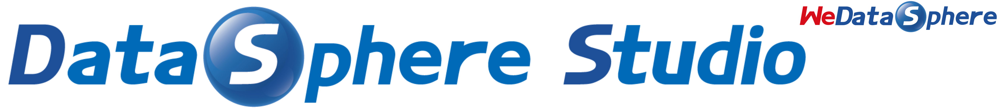

====

English | [中文](README-ZH.md)

## Introduction

 &nbsp; &nbsp; &nbsp; &nbsp;DataSphere Studio (DSS for short) is WeDataSphere, a one-stop data application development management portal developed by WeBank.

 &nbsp; &nbsp; &nbsp; &nbsp;With the pluggable integrated framework design and the Linkis, a computing middleware, DSS can easily integrate  various upper-layer data application systems, making data development simple and easy to use.

 &nbsp; &nbsp; &nbsp; &nbsp;DataSphere Studio is positioned as a data application development portal, and the closed loop covers the entire process of data application development. With a unified UI, the workflow-like graphical drag-and-drop development experience meets the entire lifecycle of data application development from data import, desensitization cleaning, data analysis, data mining, quality inspection, visualization, scheduling to data output applications, etc.

 &nbsp; &nbsp; &nbsp; &nbsp;With the connection, reusability, and simplification capabilities of Linkis, DSS is born with financial-grade capabilities of high concurrency, high availability, multi-tenant isolation, and resource management.

## UI preview

 &nbsp; &nbsp; &nbsp; &nbsp;Please be patient, it will take some time to load gif.

## Core features

### 1. One-stop, full-process application development management UI

 &nbsp; &nbsp; &nbsp; &nbsp;DSS is highly integrated. Currently integrated components include(**DSS version compatibility for the above components, please visit: [Integrated data application components](README.md#4-integrated-data-application-components)**):

 &nbsp; &nbsp; &nbsp; &nbsp;1. Data Development IDE Tool - [Scriptis](https://github.com/WeBankFinTech/Scriptis)

 &nbsp; &nbsp; &nbsp; &nbsp;2. Data Visualization Tool - [Visualis](https://github.com/WeBankFinTech/Visualis) (Based on the open source project [Davinci](https://github.com/edp963/davinci ) contributed by CreditEase)

 &nbsp; &nbsp; &nbsp; &nbsp;3. Data Quality Management Tool - [Qualitis](https://github.com/WeBankFinTech/Qualitis)

 &nbsp; &nbsp; &nbsp; &nbsp;4. Workflow scheduling tool - [Schedulis](https://github.com/WeBankFinTech/Schedulis)

 &nbsp; &nbsp; &nbsp; &nbsp;5. Data Exchange Tool - [Exchangis](https://github.com/WeBankFinTech/Exchangis) (**The upcoming Exchangis1.0 will be integrated with the DSS workflow**)

 &nbsp; &nbsp; &nbsp; &nbsp;6. Data Api Service - [DataApiService](https://github.com/WeBankFinTech/DataSphereStudio-Doc/blob/main/zh_CN/%E4%BD%BF%E7%94%A8%E6%96%87%E6%A1%A3/DataApiService%E4%BD%BF%E7%94%A8%E6%96%87%E6%A1%A3.md)

 &nbsp; &nbsp; &nbsp; &nbsp;7. Streaming Application Development Management Tool - [Streamis](https://github.com/WeBankFinTech/Streamis)

 &nbsp; &nbsp; &nbsp; &nbsp;8. One-stop machine Learning Platform - [Prophecis](https://github.com/WeBankFinTech/Prophecis) (**Integrated version will be released soon**)

 &nbsp; &nbsp; &nbsp; &nbsp;9. Workflow Task Scheduling Tool - DolphinScheduler (**In Code Merging**)
 
 &nbsp; &nbsp; &nbsp; &nbsp;10. Help documentation and beginner's guide - UserGuide (**In Code Merging**)

 &nbsp; &nbsp; &nbsp; &nbsp;11. Data Model Center - DataModelCenter (**In development**)
 
 &nbsp; &nbsp; &nbsp; &nbsp;**DSS version compatibility for the above components, please visit: [Integrated data application components](README.md#4-integrated-data-application-components)**.

 &nbsp; &nbsp; &nbsp; &nbsp;With a pluggable framework architecture, DSS is designed to allow users to quickly integrate new data application tools, or replace various tools that DSS has integrated. For example, replace Scriptis with Zeppelin, and replace Schedulis with DolphinScheduler...

 

### 2. AppConn, based on Linkis，defines a unique design concept

 &nbsp; &nbsp; &nbsp; &nbsp;AppConn is the core concept that enables DSS to easily and quickly integrate various upper-layer web systems.

 &nbsp; &nbsp; &nbsp; &nbsp;AppConn, an application connector, defines a set of unified front-end and back-end three-level integration protocols, allowing external data application systems to easily and quickly becoming a part of DSS data application development. 

 &nbsp; &nbsp; &nbsp; &nbsp;The three-level specifications of AppConn are: the first-level SSO specification, the second-level organizational structure specification, and the third-level development process specification.

 &nbsp; &nbsp; &nbsp; &nbsp;DSS arranges multiple AppConns in series to form a workflow that supports real-time execution and scheduled execution. Users can complete the entire process development of data applications with simple drag and drop operations.

 &nbsp; &nbsp; &nbsp; &nbsp;Since AppConn is integrated with Linkis, the external data application system shares the capabilities of resource management, concurrent limiting, and high performance. AppConn also allows sharable context across system level and thus makes external data application completely gets away from application silos.

### 3. Workspace, as the management unit

 &nbsp; &nbsp; &nbsp; &nbsp;With Workspace as the management unit, it organizes and manages business applications of various data application systems, defines a set of common standards for collaborative development of workspaces across data application systems, and provides user role management capabilities.

### 4. Integrated data application components

 &nbsp; &nbsp; &nbsp; &nbsp;DSS has integrated a variety of upper-layer data application systems by implementing multiple AppConns, which can basically meet the data development needs of users.

 &nbsp; &nbsp; &nbsp; &nbsp;**If desired, new data application systems can also be easily integrated to replace or enrich DSS's data application development process.** [Click me to learn how to quickly integrate new application systems](https://github.com/WeBankFinTech/DataSphereStudio-Doc/blob/main/zh_CN/%E5%BC%80%E5%8F%91%E6%96%87%E6%A1%A3/%E7%AC%AC%E4%B8%89%E6%96%B9%E7%B3%BB%E7%BB%9F%E6%8E%A5%E5%85%A5DSS%E5%BC%80%E5%8F%91%E6%8C%87%E5%8D%97.md)

| Component | Description | DSS0.X Version Requirements | DSS1.0 Version Requirements | Version Planning |
| --------------- | -------------------------------------------------------------------- | --------- | ---------- | ------ |
| [**DataApiService**](https://github.com/WeBankFinTech/DataSphereStudio-Doc/blob/main/zh_CN/%E4%BD%BF%E7%94%A8%E6%96%87%E6%A1%A3/DataApiService%E4%BD%BF%E7%94%A8%E6%96%87%E6%A1%A3.md) | Data API service. The SQL script can be quickly published as a Restful interface, providing Rest access capability to the outside world. | Not supported | >=1.0.0 | Released |
| [**Scriptis**](https://github.com/WeBankFinTech/Scriptis) | Support online script writing such as SQL, Pyspark, HiveQL, etc., submit to [Linkis](https://github.com/WeBankFinTech/Linkis ) to perform data analysis web tools. | >=0.5.0 | >=1.0.0 | Released |
| [**Schedulis**](https://github.com/WeBankFinTech/Schedulis) | Workflow task scheduling system based on Azkaban secondary development, with financial-grade features such as high performance, high availability and multi-tenant resource isolation. | >=0.5.0 | >=1.0.0 | Released |
| **EventCheck** | Provides cross-business, cross-engineering, and cross-workflow signaling capabilities. | >=0.5.0 | >=1.0.0 | Released |
| **SendEmail** | Provides the ability to send data, all the result sets of other workflow nodes can be sent by email | >=0.5.0 | >=1.0.0 | Released |
| [**Qualitis**](https://github.com/WeBankFinTech/Qualitis) | Data quality verification tool, providing data verification capabilities such as data integrity and correctness | >=0.5.0 | 1.0.1(Version currently in preparation) | **Expected end of January** |
| [**Streamis**](https://github.com/WeBankFinTech/Streamis) | Streaming application development management tool. It supports the release of Flink Jar and Flink SQL, and provides the development, debugging and production management capabilities of streaming applications, such as: start-stop, status monitoring, checkpoint, etc. | Not supported | 1.0.1(Version currently in preparation) | **Expected end of January** |
| [**Exchangis**](https://github.com/WeBankFinTech/Exchangis) | A data exchange platform that supports data transmission between structured and unstructured heterogeneous data sources, the upcoming Exchangis1. 0, will be connected with DSS workflow | not supported | Planned in 1.0.2 | **In Development** |
| [**Visualis**](https://github.com/WeBankFinTech/Visualis) | A data visualization BI tool based on the second development of Davinci, an open source project of CreditEase, provides users with financial-level data visualization capabilities in terms of data security. | >=0.5.0 | Planned in 1.0.2 | **In Development** |
| [**Prophecis**](https://github.com/WeBankFinTech/Prophecis) | A one-stop machine learning platform that integrates multiple open source machine learning frameworks. Prophecis' MLFlow can be connected to DSS workflow through AppConn. | Not supported | Planned in 1.0.2 | **In Development** |
| **UserManager** | Automatically initialize all user environments necessary for a new DSS user, including: creating Linux users, various user paths, directory authorization, etc. | >=0.9.1 | Planned in 1.0.2 | **In Development** |
| **DolphinScheduler** | Apache DolphinScheduler, a distributed and scalable visual workflow task scheduling platform, supports one-click publishing of DSS workflows to DolphinScheduler. | Not supported | Planned in 1.1.0 | **In Development** |
| **UserGuide**     | It mainly provides help documentation, beginner's guide, Dark mode skinning, etc.      | Not supported | Planning in 1.1.0 | **In Development** |
| **DataModelCenter** | It mainly provides the capabilities of data warehouse planning, data model development and data asset management. Data warehouse planning includes subject domains, data warehouse layers, modifiers, etc.; data model development includes indicators, dimensions, metrics, wizard-based table building, etc.; data assets are connected to Apache Atlas to provide data lineage capabilities. | Not supported | Planning in 1.2.0 | **In Development** |
| **Airflow** | Supports publishing DSS workflows to Airflow for scheduling. | >=0.9.1, not yet merged | Not supported | **No plans yet** |

## Demo Trial environment

 &nbsp; &nbsp; &nbsp; &nbsp;The function of DataSphere Studio supporting script execution has high security risks, and the isolation of the WeDataSphere Demo environment has not been completed. Considering that many users are inquiring about the Demo environment, we decided to first issue invitation codes to the community and accept trial applications from enterprises and organizations.

 &nbsp; &nbsp; &nbsp; &nbsp;If you want to try out the Demo environment, please join the DataSphere Studio community user group (**Please refer to the end of the document**), and contact **WeDataSphere Group Robot** to get an invitation code.

 &nbsp; &nbsp; &nbsp; &nbsp;DataSphereStudio Demo environment user registration page: [click me to enter](https://dss-open.wedatasphere.com/#/register)

 &nbsp; &nbsp; &nbsp; &nbsp;DataSphereStudio Demo environment login page: [click me to enter](https://dss-open.wedatasphere.com/#/login)

##  Download

 &nbsp; &nbsp; &nbsp; &nbsp;Please go to the [DSS Releases Page](https://github.com/WeBankFinTech/DataSphereStudio/releases) to download a compiled version or a source code package of DSS.

## Compile and deploy

 &nbsp; &nbsp; &nbsp; &nbsp;Please follow [Compile Guide]((https://github.com/WeBankFinTech/DataSphereStudio-Doc/blob/main/zh_CN/%E5%BC%80%E5%8F%91%E6%96%87%E6%A1%A3/DSS%E7%BC%96%E8%AF%91%E6%96%87%E6%A1%A3.md)) to compile DSS from source code.

 &nbsp; &nbsp; &nbsp; &nbsp;Please refer to [Deployment Documents](https://github.com/WeBankFinTech/DataSphereStudio-Doc/blob/main/zh_CN/%E5%AE%89%E8%A3%85%E9%83%A8%E7%BD%B2/DSS%E5%8D%95%E6%9C%BA%E9%83%A8%E7%BD%B2%E6%96%87%E6%A1%A3.md) to do the deployment.

## Examples and Guidance

 &nbsp; &nbsp; &nbsp; &nbsp;You can find examples and guidance for how to use DSS in [User Manual](https://github.com/WeBankFinTech/DataSphereStudio-Doc/blob/main/zh_CN/%E4%BD%BF%E7%94%A8%E6%96%87%E6%A1%A3/DSS%E7%94%A8%E6%88%B7%E6%89%8B%E5%86%8C.md).

## Documents

 &nbsp; &nbsp; &nbsp; &nbsp;For a complete list of documents for DSS1.0, see [DSS-Doc](https://github.com/WeBankFinTech/DataSphereStudio-Doc)

 &nbsp; &nbsp; &nbsp; &nbsp;The following is the installation guide for DSS-related AppConn plugins:

- [Visualis AppConn Plugin Installation Guide](https://github.com/WeBankFinTech/DataSphereStudio-Doc/blob/main/zh_CN/%E5%AE%89%E8%A3%85%E9%83%A8%E7%BD%B2/VisualisAppConn%E6%8F%92%E4%BB%B6%E5%AE%89%E8%A3%85%E6%96%87%E6%A1%A3.md)

- [Schedulis AppConn Plugin Installation Guide](https://github.com/WeBankFinTech/DataSphereStudio-Doc/blob/main/zh_CN/%E5%AE%89%E8%A3%85%E9%83%A8%E7%BD%B2/SchedulisAppConn%E6%8F%92%E4%BB%B6%E5%AE%89%E8%A3%85%E6%96%87%E6%A1%A3.md)

- [Qualitis AppConn Plugin Installation Guide](https://github.com/WeBankFinTech/DataSphereStudio-Doc/blob/main/zh_CN/%E5%AE%89%E8%A3%85%E9%83%A8%E7%BD%B2/QualitisAppConn%E6%8F%92%E4%BB%B6%E5%AE%89%E8%A3%85%E6%96%87%E6%A1%A3.md)

- [Exchangis AppConn Plugin Installation Guide](https://github.com/WeBankFinTech/DataSphereStudio-Doc/blob/main/zh_CN/%E5%AE%89%E8%A3%85%E9%83%A8%E7%BD%B2/ExchangisAppConn%E6%8F%92%E4%BB%B6%E5%AE%89%E8%A3%85%E6%96%87%E6%A1%A3.md)

## Architecture

## Usage Scenarios

 &nbsp; &nbsp;&nbsp; &nbsp;DataSphere Studio is suitable for the following scenarios:

 &nbsp; &nbsp;&nbsp; &nbsp;1. Scenarios in which big data platform capability is being prepared or initialized but no data application tools are available.

 &nbsp; &nbsp;&nbsp; &nbsp;2. Scenarios in which users already have big data foundation platform capabilities but with only a few data application tools.

 &nbsp; &nbsp;&nbsp; &nbsp;3. Scenarios in which users have the ability of big data foundation platform and comprehensive data application tools, but suffers strong isolation and and high learning costs because those tools have not been integrated together.

 &nbsp; &nbsp;&nbsp; &nbsp;4. Scenarios in which users have the capabilities of big data foundation platform and comprehensive data application tools. but lacks unified and standardized specifications, while a part of these tools have been integrated.

## Contributing

 &nbsp; &nbsp; &nbsp; &nbsp;Contributions are always welcomed, we need more contributors to build DSS together. either code, or doc, or other supports that could help the community.

 &nbsp; &nbsp; &nbsp; &nbsp;For code and documentation contributions, please follow the contribution guide.

## Communication

 &nbsp; &nbsp; &nbsp; &nbsp;For any questions or suggestions, please kindly submit an issue.

 &nbsp; &nbsp; &nbsp; &nbsp;You can scan the QR code below to join our WeChat and QQ group to get more immediate response.

## Who is using DSS

 &nbsp; &nbsp; &nbsp; &nbsp;We opened an issue for users to feedback and record who is using DSS.

 &nbsp; &nbsp; &nbsp; &nbsp;Since the first release of DSS in 2019, it has accumulated more than 700 trial companies and 1000+ sandbox trial users, which involving diverse industries, from finance, banking, tele-communication, to manufactory, internet companies and so on.

## License

 &nbsp; &nbsp; &nbsp; &nbsp;DSS is under the Apache 2.0 license. See the [License](LICENSE) file for details.
