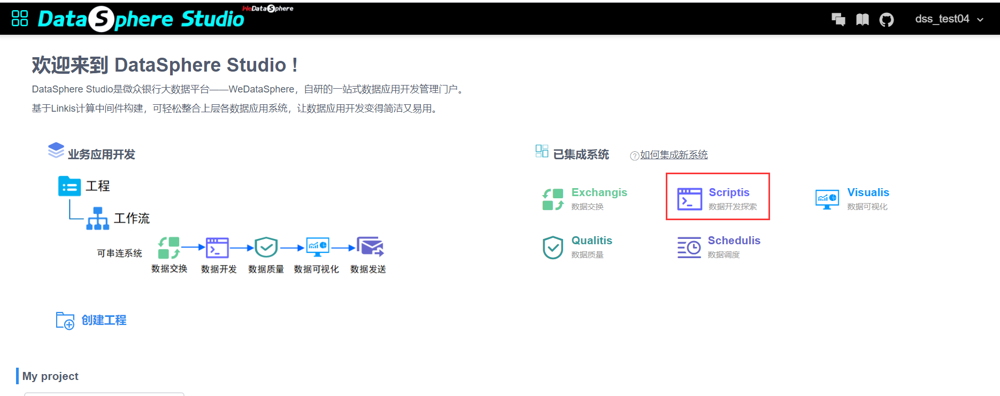
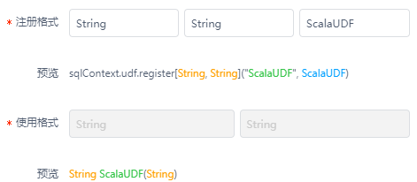
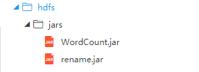
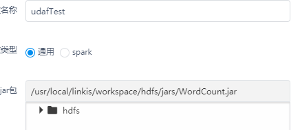

# DSS用户测试样例1：Scala

DSS用户测试样例的目的是为平台新用户提供一组测试样例，用于熟悉DSS的常见操作，并验证DSS平台的正确性



## 1.1 Spark Core（入口函数sc）

在script中，已经默认为您注册了SparkContext，所以直接使用sc即可：

### 1.1.1 单Value算子(Map算子为例)

```scala
val rddMap = sc.makeRDD(Array((1,"a"),(1,"d"),(2,"b"),(3,"c")),4)
val res = rddMap.mapValues(data=>{data+"||||"})
res.collect().foreach(data=>println(data._1+","+data._2))
```

### 1.1.2 双Value算子(union算子为例)

```scala
val rdd1 = sc.makeRDD(1 to 5)
val rdd2 = sc.makeRDD(6 to 10)
val rddCustom = rdd1.union(rdd2)
rddCustom.collect().foreach(println)
```

### 1.1.3 K-V算子(reduceByKey算子为例子)

```scala
val rdd1 = sc.makeRDD(List(("female",1),("male",2),("female",3),("male",4)))
val rdd2 = rdd1.reduceByKey((x,y)=>x+y)
rdd2.collect().foreach(println)
```

### 1.1.4 执行算子(以上collect算子为例)

### 1.1.5 从hdfs上读取文件并做简单执行

```scala
case class Person(name:String,age:String)
val file = sc.textFile("/test.txt")
val person = file.map(line=>{
               val values=line.split(",")
         
     Person(values(0),values(1))
})
val df = person.toDF()
df.select($"name").show()
```


## 1.2 UDF函数测试

### 1.2.1 函数定义


```scala
def ScalaUDF3(str:  String):  String  =  "hello, "  + str  + "this is a third attempt"
```

### 1.2.2 注册函数

函数-》个人函数-》右击新增spark函数=》注册方式同常规spark开发

​                           

## 1.3 UDAF函数测试

### 1.3.1 Jar包上传

​        idea上开发一个求平均值的udaf函数，打成jar(wordcount)包,上传dss jar文件夹。

​                        

### 1.3.2 注册函数

函数-》个人函数-》右击新增普通函数=》注册方式同常规spark开发          

                          